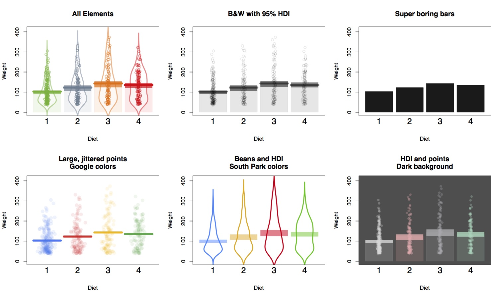
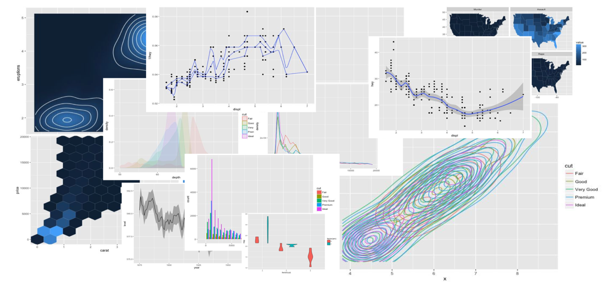

## Prologue
You can find this slide at https://github.com/dddd1007/VisulizationLesson

```{r, include=FALSE}
knitr::opts_chunk$set(fig.show = "hold", dpi = 300, fig.width = 10, fig.height = 6, message = FALSE)
options(warn=-1)
```


And you should finish this lesson with those packages as follow:
- tidyverse
- vioplot
- yarrr
- superheat
- corrgram
- factoextra

---
## Why we should visual our data?
```{r}
data(anscombe)
```
<table class='gmisc_table' style='border-collapse: collapse; margin-top: 1em; margin-bottom: 1em;' >
<thead>
<tr>
<th style='border-top: 2px solid grey;'></th>
<th colspan='2' style='font-weight: 900; border-bottom: 1px solid grey; border-top: 2px solid grey; text-align: center;'>Data 1</th><th style='border-top: 2px solid grey;; border-bottom: hidden;'>&nbsp;</th>
<th colspan='2' style='font-weight: 900; border-bottom: 1px solid grey; border-top: 2px solid grey; text-align: center;'>Data 2</th><th style='border-top: 2px solid grey;; border-bottom: hidden;'>&nbsp;</th>
<th colspan='2' style='font-weight: 900; border-bottom: 1px solid grey; border-top: 2px solid grey; text-align: center;'>Data 3</th><th style='border-top: 2px solid grey;; border-bottom: hidden;'>&nbsp;</th>
<th colspan='2' style='font-weight: 900; border-bottom: 1px solid grey; border-top: 2px solid grey; text-align: center;'>Data 4</th>
</tr>
<tr>
<th style='border-bottom: 1px solid grey;'> </th>
<th style='border-bottom: 1px solid grey; text-align: center;'>x-value</th>
<th style='border-bottom: 1px solid grey; text-align: center;'>y-value</th>
<th style='border-bottom: 1px solid grey;' colspan='1'>&nbsp;</th>
<th style='border-bottom: 1px solid grey; text-align: center;'>x-value</th>
<th style='border-bottom: 1px solid grey; text-align: center;'>y-value</th>
<th style='border-bottom: 1px solid grey;' colspan='1'>&nbsp;</th>
<th style='border-bottom: 1px solid grey; text-align: center;'>x-value</th>
<th style='border-bottom: 1px solid grey; text-align: center;'>y-value</th>
<th style='border-bottom: 1px solid grey;' colspan='1'>&nbsp;</th>
<th style='border-bottom: 1px solid grey; text-align: center;'>x-value</th>
<th style='border-bottom: 1px solid grey; text-align: center;'>y-value</th>
</tr>
</thead>
<tbody>
<tr>
<td style='text-align: left;'>1</td>
<td style='text-align: center;'>10</td>
<td style='text-align: center;'>8.04</td>
<td style='' colspan='1'>&nbsp;</td>
<td style='text-align: center;'>10</td>
<td style='text-align: center;'>9.14</td>
<td style='' colspan='1'>&nbsp;</td>
<td style='text-align: center;'>10</td>
<td style='text-align: center;'>7.46</td>
<td style='' colspan='1'>&nbsp;</td>
<td style='text-align: center;'>8</td>
<td style='text-align: center;'>6.58</td>
</tr>
<tr>
<td style='text-align: left;'>2</td>
<td style='text-align: center;'>8</td>
<td style='text-align: center;'>6.95</td>
<td style='' colspan='1'>&nbsp;</td>
<td style='text-align: center;'>8</td>
<td style='text-align: center;'>8.14</td>
<td style='' colspan='1'>&nbsp;</td>
<td style='text-align: center;'>8</td>
<td style='text-align: center;'>6.77</td>
<td style='' colspan='1'>&nbsp;</td>
<td style='text-align: center;'>8</td>
<td style='text-align: center;'>5.76</td>
</tr>
<tr>
<td style='text-align: left;'>3</td>
<td style='text-align: center;'>13</td>
<td style='text-align: center;'>7.58</td>
<td style='' colspan='1'>&nbsp;</td>
<td style='text-align: center;'>13</td>
<td style='text-align: center;'>8.74</td>
<td style='' colspan='1'>&nbsp;</td>
<td style='text-align: center;'>13</td>
<td style='text-align: center;'>12.74</td>
<td style='' colspan='1'>&nbsp;</td>
<td style='text-align: center;'>8</td>
<td style='text-align: center;'>7.71</td>
</tr>
<tr>
<td style='text-align: left;'>4</td>
<td style='text-align: center;'>9</td>
<td style='text-align: center;'>8.81</td>
<td style='' colspan='1'>&nbsp;</td>
<td style='text-align: center;'>9</td>
<td style='text-align: center;'>8.77</td>
<td style='' colspan='1'>&nbsp;</td>
<td style='text-align: center;'>9</td>
<td style='text-align: center;'>7.11</td>
<td style='' colspan='1'>&nbsp;</td>
<td style='text-align: center;'>8</td>
<td style='text-align: center;'>8.84</td>
</tr>
<tr>
<td style='text-align: left;'>5</td>
<td style='text-align: center;'>11</td>
<td style='text-align: center;'>8.33</td>
<td style='' colspan='1'>&nbsp;</td>
<td style='text-align: center;'>11</td>
<td style='text-align: center;'>9.26</td>
<td style='' colspan='1'>&nbsp;</td>
<td style='text-align: center;'>11</td>
<td style='text-align: center;'>7.81</td>
<td style='' colspan='1'>&nbsp;</td>
<td style='text-align: center;'>8</td>
<td style='text-align: center;'>8.47</td>
</tr>
<tr>
<td style='text-align: left;'>6</td>
<td style='text-align: center;'>14</td>
<td style='text-align: center;'>9.96</td>
<td style='' colspan='1'>&nbsp;</td>
<td style='text-align: center;'>14</td>
<td style='text-align: center;'>8.1</td>
<td style='' colspan='1'>&nbsp;</td>
<td style='text-align: center;'>14</td>
<td style='text-align: center;'>8.84</td>
<td style='' colspan='1'>&nbsp;</td>
<td style='text-align: center;'>8</td>
<td style='text-align: center;'>7.04</td>
</tr>
<tr>
<td style='text-align: left;'>7</td>
<td style='text-align: center;'>6</td>
<td style='text-align: center;'>7.24</td>
<td style='' colspan='1'>&nbsp;</td>
<td style='text-align: center;'>6</td>
<td style='text-align: center;'>6.13</td>
<td style='' colspan='1'>&nbsp;</td>
<td style='text-align: center;'>6</td>
<td style='text-align: center;'>6.08</td>
<td style='' colspan='1'>&nbsp;</td>
<td style='text-align: center;'>8</td>
<td style='text-align: center;'>5.25</td>
</tr>
<tr>
<td style='text-align: left;'>8</td>
<td style='text-align: center;'>4</td>
<td style='text-align: center;'>4.26</td>
<td style='' colspan='1'>&nbsp;</td>
<td style='text-align: center;'>4</td>
<td style='text-align: center;'>3.1</td>
<td style='' colspan='1'>&nbsp;</td>
<td style='text-align: center;'>4</td>
<td style='text-align: center;'>5.39</td>
<td style='' colspan='1'>&nbsp;</td>
<td style='text-align: center;'>19</td>
<td style='text-align: center;'>12.5</td>
</tr>
<tr>
<td style='text-align: left;'>9</td>
<td style='text-align: center;'>12</td>
<td style='text-align: center;'>10.84</td>
<td style='' colspan='1'>&nbsp;</td>
<td style='text-align: center;'>12</td>
<td style='text-align: center;'>9.13</td>
<td style='' colspan='1'>&nbsp;</td>
<td style='text-align: center;'>12</td>
<td style='text-align: center;'>8.15</td>
<td style='' colspan='1'>&nbsp;</td>
<td style='text-align: center;'>8</td>
<td style='text-align: center;'>5.56</td>
</tr>
<tr>
<td style='text-align: left;'>10</td>
<td style='text-align: center;'>7</td>
<td style='text-align: center;'>4.82</td>
<td style='' colspan='1'>&nbsp;</td>
<td style='text-align: center;'>7</td>
<td style='text-align: center;'>7.26</td>
<td style='' colspan='1'>&nbsp;</td>
<td style='text-align: center;'>7</td>
<td style='text-align: center;'>6.42</td>
<td style='' colspan='1'>&nbsp;</td>
<td style='text-align: center;'>8</td>
<td style='text-align: center;'>7.91</td>
</tr>
<tr>
<td style='border-bottom: 2px solid grey; text-align: left;'>11</td>
<td style='border-bottom: 2px solid grey; text-align: center;'>5</td>
<td style='border-bottom: 2px solid grey; text-align: center;'>5.68</td>
<td style='border-bottom: 2px solid grey;' colspan='1'>&nbsp;</td>
<td style='border-bottom: 2px solid grey; text-align: center;'>5</td>
<td style='border-bottom: 2px solid grey; text-align: center;'>4.74</td>
<td style='border-bottom: 2px solid grey;' colspan='1'>&nbsp;</td>
<td style='border-bottom: 2px solid grey; text-align: center;'>5</td>
<td style='border-bottom: 2px solid grey; text-align: center;'>5.73</td>
<td style='border-bottom: 2px solid grey;' colspan='1'>&nbsp;</td>
<td style='border-bottom: 2px solid grey; text-align: center;'>8</td>
<td style='border-bottom: 2px solid grey; text-align: center;'>6.89</td>
</tr>
</tbody>
</table>

---
## Try to do a statistical analysis
### Like ... Correlation?
```{r}
cor(anscombe$x1, anscombe$y1)
cor(anscombe$x2, anscombe$y2)
cor(anscombe$x3, anscombe$y3)
cor(anscombe$x4, anscombe$y4)
```

---
### Or a Linear Model?
```{r}
ff <- y ~ x
mods <- setNames(as.list(1:4), paste0("lm", 1:4))
for(i in 1:4) {
  ff[2:3] <- lapply(paste0(c("y","x"), i), as.name)
  mods[[i]] <- lmi <- lm(ff, data = anscombe)
}
sapply(mods, coef)
```

---
### But if we do a visualization firstly?
.center[
```{r, echo=FALSE}
op <- par(mfrow = c(2, 2), mar = 0.1+c(4,4,1,1), oma =  c(0, 0, 2, 0))
for(i in 1:4) {
  ff[2:3] <- lapply(paste0(c("y","x"), i), as.name)
  plot(ff, data = anscombe, col = "red", pch = 21, bg = "orange", cex = 1.2,
       xlim = c(3, 19), ylim = c(3, 13))
}
mtext("Anscombe's 4 Regression data sets", outer = TRUE, cex = 1.5)
par(op)
```
]

---
## Basic Plot
- Histogram
- Bar Plot
- Boxplot
- Pie Chart

--
```{r}
head(iris)
```

---
### Histogram
```{r}
hist(iris$Sepal.Length)
```

---
### Bar Plot
```{r}
barplot(table(iris$Species))
```

---
#### Tip
**Notice the different between histogram and bar charts.**

---
### boxplot
```{r}
boxplot(Sepal.Length ~ Species, data = iris)
```


---
### Pie Chart
```{r}
pie(c(1,1,1),levels(iris$Species))
```

---
## Should I need to know some other charts?
.center[]

---
## Some charts using raw data
- Scatter Plot
- Violin Plot
- Pirate Plot

---
### Scatter Plot
```{r}
plot(iris$Sepal.Length, iris$Sepal.Width)
```

---
### Violin Plot
```{r, echo=FALSE}
library(vioplot)
vioplot(iris$Sepal.Length[which(iris$Species == "setosa")], iris$Sepal.Length[which(iris$Species == "virginica")], iris$Sepal.Length[which(iris$Species == "versicolor")], col = "grey")
```

---
### Pirate Plot
```{r}
yarrr::pirateplot(Sepal.Length ~ Species, data = iris)
```

---
### Pirate Plot
.center[]

---
## May you find some cool figure of papers sometimes.
Like this...
--
.center[]

---
Like this...
```{r, echo=FALSE, fig.height = 8}
corrgram::corrgram(iris[-5], upper.panel = NULL)
```

---
this...
```{r, echo=FALSE, fig.height=8}
library(superheat)
superheat(X = iris[,-c(1, 5)],
                yr = iris[,1],
                yr.axis.name = "Sepal.Length",
                membership.rows = iris$Species)
```

---
this...
```{r, echo=FALSE, fig.height = 8}
library(factoextra)
library(ggthemes)
data("USArrests")
df <- scale(USArrests)
# 2. Compute k-means
set.seed(123)
km.res <- kmeans(scale(USArrests), 4, nstart = 25)
# 3. Visualize
factoextra::fviz_cluster(km.res, data = df,
             palette = c("#00AFBB","#2E9FDF", "#E7B800", "#FC4E07"),
             ggtheme = theme_minimal())
```

---
this...
```{r, echo=FALSE, message=FALSE, fig.height=8}
layout_map <- function(ncol = NA, nrow = NA, ch_start = 1, probe_start = 1, save_filename = "layout.png"){
  
  options(warn=-1)
  
  if (!require(tidyverse)){
    install.packages(tidyverse)
  }

  map_col <- 2*ncol - 1
  map_row <- 2*nrow - 1
  map_data <- data.frame(matrix(0, ncol = 4, nrow = map_col * map_row))
  names(map_data) <- c("X", "Y", "Num", "color")

  map_data$X <- rep(1:map_col, map_row)
  map_data$Y <- sort(rep(map_row:1, map_col), decreasing = T)
  
  start_from <- probe_start

  num <- start_from : ((((map_col * map_row) - 1 )/ 2) + (start_from - 1))
  for(i in 1 : length(num)){
    map_data$Num[2*i] <- num[i]
  }
  map_data$Num[map_data$Num == 0] <- NA
  map_data$color[map_data$color == 0] <- NA

  color_map <- map_data %>%
    filter(Y %% 2 == 1, X %% 2 == 1) %>%
    select(X, Y, color)
  if(nrow(color_map) %% 2 == 0){
    color_map$color <- c("red", "blue")
    }else{
    color_map$color[-nrow(color_map)] <- c("red", "blue")
    color_map$color[nrow(color_map)] <- "red"
  }

  map_data <- left_join(map_data[-4], color_map, by = c("X","Y")) %>%
    mutate(probe = color)
  map_data$probe[which(map_data$probe == "red")] <- c(1 : 100)[1 : length(which(map_data$probe == "red"))]
  map_data$probe[which(map_data$probe == "blue")] <- c(1 : 100)[1 : length(which(map_data$probe == "blue"))]
  
ggplot(map_data, aes(x = X, y = Y)) + 
    geom_tile(aes(fill = color)) + 
    scale_fill_identity(c("red" = "red", "blue" = "blue")) + 
    coord_equal(ratio = 1) + 
    geom_text(aes(label = Num)) + 
    geom_text(aes(label = probe), color = "white", size = 6) +
    theme_bw() + 
    theme(axis.line = element_blank(),
          panel.grid.major = element_blank(),
          panel.grid.minor = element_blank(),
          panel.border = element_blank(),
          panel.background = element_blank(),
          axis.text = element_blank(),
          axis.title = element_blank(),
          axis.ticks = element_blank()) 
}
layout_map(5,3)
```

---
### And you can plot them by searching on the Internet.

**相关图**

corrgram::corrgram(iris[-5], upper.panel = NULL)

**热力图**

superheat(X = iris[,-c(1, 5)],
                yr = iris[,1],
                yr.axis.name = "Sepal.Length",
                membership.rows = iris$Species)
                
**聚类图**

data("USArrests")
df <- scale(USArrests)
km.res <- kmeans(scale(USArrests), 4, nstart = 25)
factoextra::fviz_cluster(km.res, data = df,ggtheme = theme_minimal())

---
background-image: url(hadly.jpg)

---
## ggplot2
--

### The Grammar of Graphics
.center[]

---
## Three Basic elements

- Layer
- Aesthetics
- Geometric

---
## Scatter Plot
```{r}
ggplot(iris) + geom_point(aes(x = Sepal.Length, y = Sepal.Width))
```

---
## Scatter Plot
```{r,fig.height=5}
ggplot(iris) + 
  geom_point(aes(x = Sepal.Length, y = Sepal.Width, colour = Species))
```

---
## Scatter Plot
```{r, fig.height=5}
ggplot(iris) + 
  geom_point(aes(x = Sepal.Length, y = Sepal.Width, colour = Species)) +
  stat_smooth(aes(x = Sepal.Length, y = Sepal.Width))
```

---
## Scatter Plot
```{r, fig.height=5}
ggplot(iris) + 
  geom_point(aes(x = Sepal.Length, y = Sepal.Width, colour = Species)) +
  stat_smooth(aes(x = Sepal.Length, y = Sepal.Width)) +
  facet_grid(Species ~ .)
```

---
## Boxplot
--

Sepal.Length ~ Species
```{r, fig.height=5}
ggplot(iris) + geom_boxplot(aes(x = Species, y = Sepal.Length))
```

---
## Boxplot
Change color
--
```{r, fig.height=4.5}
ggplot(iris) + 
  geom_boxplot(aes(x = Species, y = Sepal.Length, fill = Species))
```

---
## Boxplot
Change theme
--
```{r, fig.height=4.5}
ggplot(iris) + 
  geom_boxplot(aes(x = Species, y = Sepal.Length, fill = Species)) + 
  ggthemes::theme_economist()
```

---
## Boxplot
Change color scale
--
```{r, fig.height=4}
ggplot(iris) + 
  geom_boxplot(aes(x = Species, y = Sepal.Length, fill = Species)) + 
  ggthemes::theme_economist() +
  scale_fill_brewer()
```

---
## qqplot
--
```{r, fig.height=5}
ggplot(iris) + 
  geom_qq(aes(sample = Sepal.Length))
```

---
## Histogram
--
```{r,fig.height=5}
ggplot(iris) +
  geom_histogram(aes(x = Sepal.Length))
```

---
## Barplot
--
```{r, fig.height=5}
ggplot(iris) +
  geom_bar(aes(x = Species))
```

---
## Barplot
--
Change color by group
```{r, fig.height=5}
ggplot(iris) +
  geom_bar(aes(x = Species, fill = Species))
```

---
## So why we should use ggplot2?
- The understandable logic of the grammar.
- The automatic statistical calculation.
- Automatic legends, colors, etc.
- Nice output.
- Easy to extend.
